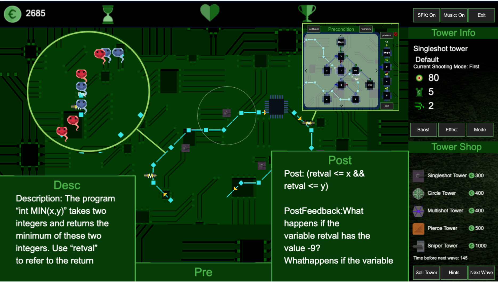

# FormalZ

FormalZ is a browser-based education game to train users to write formal specifications in the form of pre- and post-conditions of a program.

There are two user-roles: _teacher_ and _student_. A teacher can create a class room, and populate it with "problems". Students can register to a class room, and play the problems offered there. Each problem gives an informal description of some program P(x). The student's task is to translate the informal specification to a formal one, expressed as predicate logic formulas. For each problem, a pre- and a post-condition of the program in question must be formulated. For example, such a problem can be:

   * _A program allZero(a) checks if a non-null integer array a consists of only 0 as elements._

This informal specification can be formalized as:

  * Pre-condition: `a != null`
  * Post-condition: `retval = forall(a, i -> a[i]==0)`

However, rather than just trying to puzzle this out with just a pen and paper (boring), FormalZ is a game that will help you to train this skill in a fun way.

Creating rooms and problems, registering to a room and selecting problems to play as mentioned above happen through a web-based application. We can think this as the room and user management part of FormalZ.

Once the student select a problem to 'solve', the game FormalZ will launch inside the student's browser.
It is setup as a 'CPU-defense' game (a la tower defense) where you have to defend a computation unit (we will call it CPU) on a circuit board against hackers' attack. The CPU receives data packages (we will call them sparks) through some conductive tracks, and in turn also output sparks for other components on the board.

The hackers have found a way to unexpectedly corrupt sparks on some conductive tracks: one input track leading into the CPU and one output track leading out from the CPU. Fortunately, the designer of the circuit board has anticipated this kind of malice and has built scanners that can mark corrupted sparks. The scanners themselves cannot eliminate the sparks they mark. For this you need to put extra hardware on the circuit board called defense towers. These towers can neutralize marked sparks to prevent them from reaching the CPU as well as from leaving the CPU to contaminate other critical components. In a harder difficulty level, a single tower may not be enough to shoot down all marked sparks, or even to shoot down a single spark. So, you will need multiple towers to do the job.

### Game Manual

[See here.](./formalzGameManual/manualhome.html)

### Architecture

There are four components as shown in the image above:

  1. The game-client (the FormalZ game itself). This is a browser-based game written in Javascript.
  1. The game-server (Java). Multiple instances of the game-clients will connect to this server, e.g. to obtain problems and to send candidate solutions for checking.
  1. The web-server. This hosts the room and user management application. This side also controls the back-end database where rooms and users information is persistently stored.
  1. Haskell-backend. This server is the one that actually do formulas checking; that is, whether candidates pre- and post-conditions sent by each user are equivalent to the model solution provided by the teacher.

### Repository content

This repository contains the source code for all components mentioned above, except the Haskell-backend, which is hosted in a separate project:

* [FormalZ back-end formula checker](https://github.com/FormalZ/fchecker)

You can also check UCM fork, adapted to ease analytics, integration, and deployment: [UCM FormalZ fork](https://github.com/e-ucm/formalz-game)

### Installer and dockers

* [Installer](https://github.com/e-ucm/formalz-installer)
* FormalZ game-server’s docker: [docker image](https://hub.docker.com/r/eucm/formalz-gameserver)
* FormalZ webserver’s docker: [docker image](https://hub.docker.com/r/eucm/formalz-backend)
* FormalZ Haskell-backend’s docker: [docker image](https://hub.docker.com/r/eucm/formalz-fchecker)

### Acknowledgement

This project is supported by the EU Erasmus+ project IMPRESS. We are very thankful for the support  :heart_eyes:

